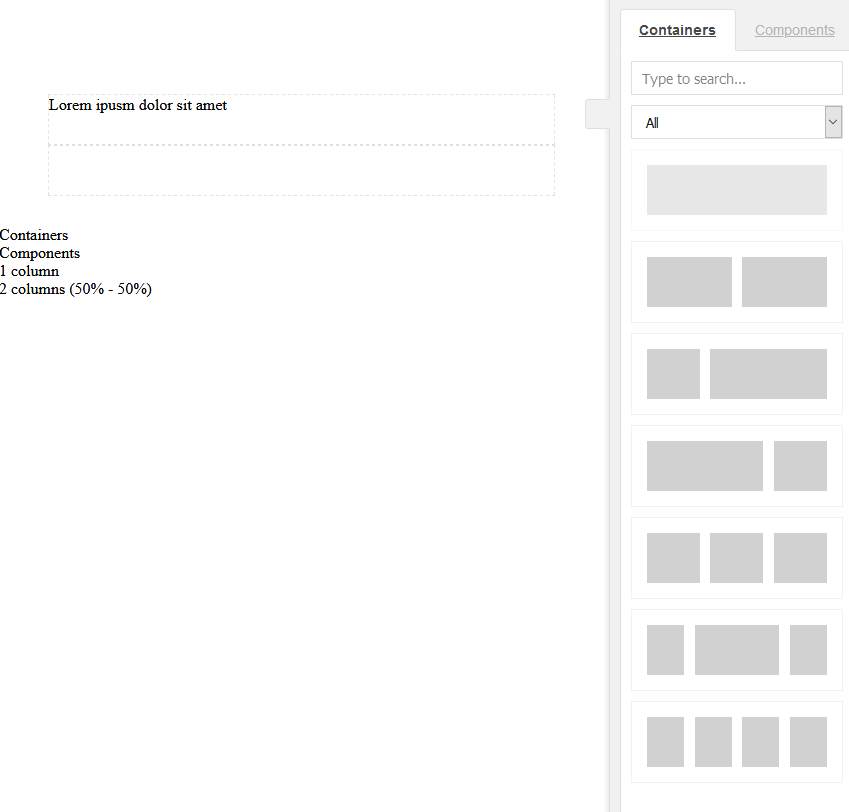

# structure_concept
This is a Redaxo 5 concept addon for a new structure management.

## Features
- Frontendbuilder

## Requirements
- mform
- cke5

## Setup
1. Copy files to addon folder and install through backend
2. Create a template and use the code from folder "/templates/example.tpl"
3. Create a module and use the code from "/modules/example.input" and "/modules/example.output"